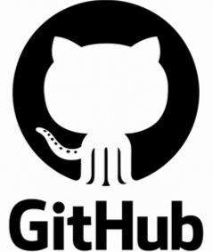

# P01: GitHub. Treballant de forma col·laborativa: forks i pull request.

Molt bona feina, equip.
Ara que dominem les eines de manera individual (servidors, permisos, etc.), és hora d'aprendre a treballar com ho fem realment a EverPia: com un equip coordinat.
A la nostra consultora, és impensable que tothom treballi en una sola branca "main" o que s'enviïn arxius de configuració per correu. Treballem amb un flux de treball de Git/GitHub professional, on hi ha jerarquies (Caps d'Equip, Júniors) i un procés estricte de revisió de codi (Pull Requests).
En aquesta activitat, simularem el nostre procés d'Onboarding (incorporació) de nous consultors. Configurarem el repositori central de la nostra empresa.
El vostre objectiu no és només pujar un arxiu, sinó dominar el flux de treball de col·laboració de Git, incloent forks, pull requests. Aquesta és una de les habilitats més demandades al sector.

