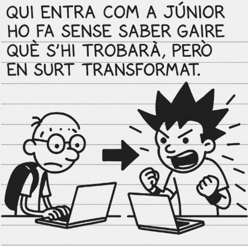
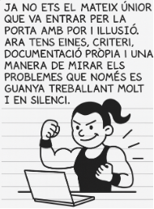
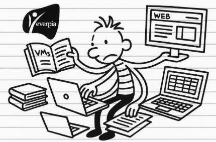
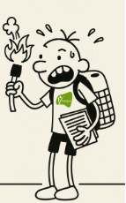
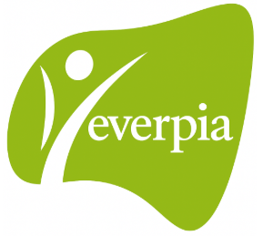
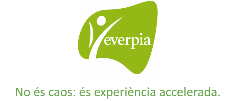

# Projecte4
## EverPia 3: “Sobreviure en una empresa IT”
Després de setmanes convivint amb el ritme imprevisible d’una consultora tecnològica, arriba al darrer capítol de la trilogia EverPia. És un moment que combina entusiasme, maduresa i una sensació molt real: aquesta etapa s’acaba, i comença alguna cosa nova.
A les consultores, la trajectòria professional segueix un patró gairebé universal: 
Qui entra com a júnior ho fa sense saber gaire què s’hi trobarà, però en surt transformat.

De sobte et veus apagant incendis, assumint tasques que no surten al contracte, donant suport a companys amb més anys que tu, resolent problemes d’origen desconegut i aprenent a una velocitat que no apareix a cap manual.
- Aquesta intensitat et fa créixer.
- Aquesta pressió et defineix.
- Aquesta experiència accelerada et converteix en professional.
I un dia, sense adonar-te’n, descobreixes que ja no ets el mateix júnior que va entrar per la porta amb por i il·lusió. Ara tens eines, criteri, documentació pròpia i una manera de mirar els problemes que només es guanya treballant molt i en silenci.

Aquest projecte neix exactament d’aquí: d’aquell moment en què tu —com qualsevol treballador de consultoria— comences a intuir que estàs preparat per fer el salt.

Per deixar de ser la baula més jove de la cadena i començar a dissenyar el seu propi camí.
Ara ja ho sap: està a punt de sortir d’EverPia.

I vol fer-ho per la porta gran.

Aquest projecte és la seva oportunitat per demostrar qui és després de tot el que ha viscut: què ha après, com treballa, com documenta, com investiga, com proposa solucions i com afronta reptes complexos sense perdre el nord.
No és un conjunt de tasques. És la seva carta de presentació professional.

Ja saps que et trobes a les últimes setmanes a EverPia. I precisament per això vols acabar per la porta gran: demostrant que domina allò que fa uns mesos li semblava impossible, validant la seva capacitat de treball en equip i executant tasques que requereixen una mirada madura i professional. Aquest projecte no és només un conjunt d’exercicis: és la seva carta de presentació abans de començar a caminar amb més autonomia, confiança i criteri propi.

Aquest projecte representa la darrera etapa del període de pràctiques internes dels alumnes dins l’empresa EverPia, on han estat treballant en qualitat de junior IT durant tot el trimestre. 

Durant quatre setmanes, hauràs de donar resposta a encàrrecs reals dins l’ecosistema empresarial d’EverPia: gestió d’emergències, millora de processos, automatització de sistemes, administració de repositoris, implementació de serveis d’accés remot i desplegament de solucions de disseny i comerç electrònic. Aquest projecte vol posar-los en situació d’assumir, amb autonomia progressiva, rols i responsabilitats similars als que trobarien en una empresa tecnològica de mida petita o mitjana.

## Objectius generals del projecte
Aquest projecte integra tots els mòduls i sintetitza les experiències viscudes en els projectes anteriors. L’alumne haurà de:
1. Integrar coneixements tècnics en un context professional realista
Seguretat, Sistemes Operatius en Xarxa, Serveis de Xarxa i Aplicacions Web treballats de forma coordinada i aplicada.
2. Dominar processos de backup i recuperació
Crear, validar i restaurar imatges completes d’un sistema operatiu utilitzant eines professionals.
3. Desplegar serveis IT corporatius
NFS, CUPS, SSH i escriptoris remots com en un entorn d’empresa.
4. Consolidar competències de disseny digital
Prototipatge funcionals en Figma, preparant la base d’un futur ecommerce.
5. Iniciar la gestió professional de versions
Primer contacte amb Git i repositoris locals a través de Visual Studio Code.
6. Incorporar la mirada sostenible en el treball tècnic
Economia circular, consum responsable i reflexions sobre l’impacte de les tecnologies utilitzades.
7. Utilitzar metodologies d’organització i gestió del flux de treball
Tauler Kanban amb planificació, assignació i seguiment de tasques.
8. Millorar competències transversals essencials
Autonomia, comunicació, treball en equip, documentació rigorosa i gestió de problemes complexos.

El repte: preparar EverPia per al seu salt tecnològic
EverPia es troba en ple creixement i necessita reforçar la seva infraestructura per escalar serveis, millorar la resiliència i oferir noves solucions digitals als seus clients.
L’alumne formarà part d’un equip júnior que haurà de:

Bloc tècnic

- Crear i restaurar imatges amb Rescuezilla.
- Proposar estratègies de backup viables per a equips Windows.
- Desplegar un servidor NFS amb i sense LDAP.
- Implementar un servidor d’impressió CUPS.
- Preparar i testar solucions d’accés remot.

Bloc creatiu i organitzatiu

- Dissenyar un prototip corporatiu + ecommerce inicial amb Figma.
- Iniciar l’ús de Git amb repositoris locals i primers commits.
- Documentar processos i decisions amb qualitat professional.
- Mantenir un Kanban actualitzat amb seguiment real.
- Integrar la mirada sostenible dins del projecte.

Aquest conjunt de reptes exigeix visió global, constància i una actitud resolutiva pròpia d’un perfil júnior que està a punt de fer el salt cap a la seva pròpia trajectòria.

Producte final: la teva carpeta professional
En acabar el projecte, l’alumne haurà lliurat:
- Imatge de restauració funcional amb prova documentada.

- Informe comparatiu de solucions de backup i proposta final.

- Servidor NFS operatiu i documentat.

- Servidor CUPS amb proves.

- Informe complet d’accés remot amb valoració de solucions.

- Prototip Figma corporatiu + ecommerce inicial.

- Repositori Git organitzat amb commits coherents.

- Tauler Kanban complet i actualitzat.

- Reflexió en clau de sostenibilitat i economia circular.

Un conjunt de productes que constitueixen una carpeta de treball professional, la millor prova del seu progrés i del seu futur potencial en el món IT.

